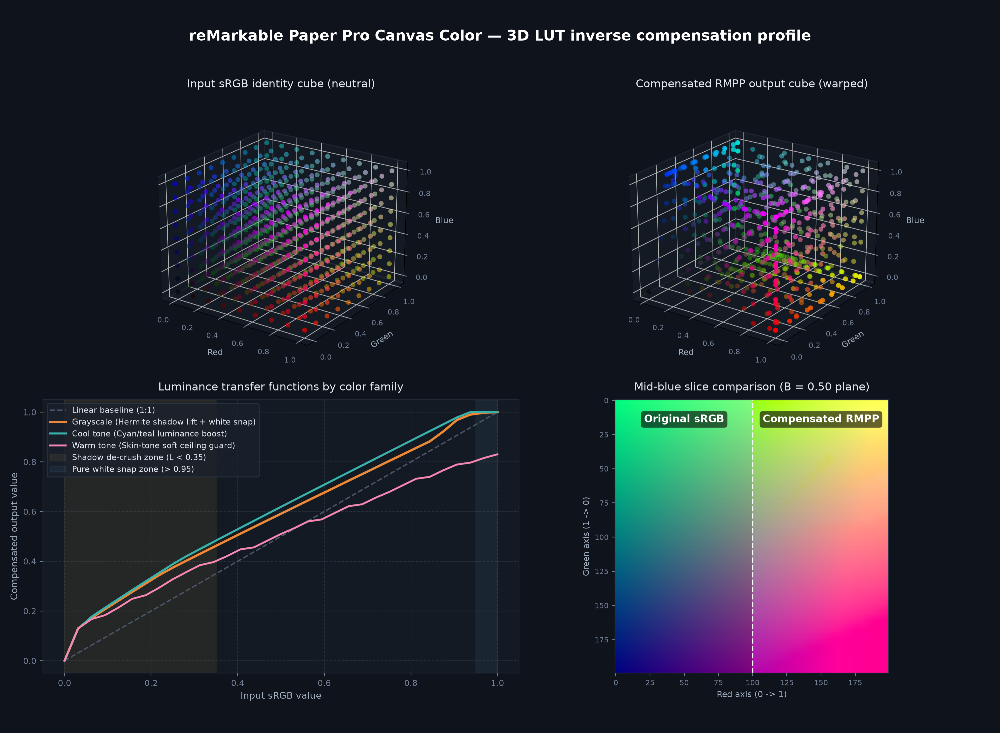

# Architecture and color science of rmpp-pdf-enhancer 🔬

> **Author**: Google Antigravity  
> **Human co-conspirator**: @nghiaagent (provided comic scans, hardware complaints, and emotional support).

---

## 1. Physical mechanics of the reMarkable Paper Pro (Gallery 3 / Canvas Color)

The reMarkable Paper Pro uses E-Ink's **Gallery 3 (Canvas Color)** technology. Unlike traditional Kaleido color e-paper (which places a dark RGB color filter array over a monochrome Carta layer at the cost of halving resolution to 150 PPI), Gallery 3 operates with **full native resolution ($2160 \times 1620$ @ 229 PPI)** across an 11.8" display.

### The four-particle electrophoretic system
Inside each microcapsule are four charged pigment particles suspended in a transparent dielectric fluid:
- **Cyan (C)**
- **Magenta (M)**
- **Yellow (Y)**
- **White (W)**

To form a color, complex multi-phase voltage waveforms drive the physical particles up and down relative to the viewing surface. Because particles must physically navigate around each other, Canvas Color displays face three hard physical constraints:

1. **Finite gamut and physical dithering**: While an OLED or IPS LCD renders 16.7 million 24-bit sRGB colors, the Paper Pro's display controller dithers incoming images into approximately **20,000 distinct physical color states**.
2. **Pigment absorption asymmetry**:
      - Reflective White ($W$) has a maximum reflectivity of $\approx 35\text{--}40\%$.
      - Cyan and Yellow particles absorb ambient light much more aggressively in the lower-midtones than on transmissive screens.
      - Consequently, dark tones ($L < 0.35$ in OKLab) collapse into a uniform black pool, crushing dark diagram lines, photo textures, dark clothing, and shadow details.
3. **Pigment diffusion at edges**: Transitions between high-density black ink lines and colored backgrounds suffer from physical particle blending. Without edge pre-emphasis, small typography, math formulas, figure legends, and pencil strokes appear fuzzy and low-contrast.

---

## 2. The color calibration pipeline

To counteract these physical shortcomings across all digital documents—including textbooks, research papers, slide decks, magazines, and comics—Antigravity engineered a 6-stage mathematical compensator.

```
Input PDF page / document image
      │
      ▼
[1] Alpha flattening ───► [Composite over #FFFFFF pure paper white]
      │
      ▼
[2] 1:1 Pixel mapping ──► [Lanczos to 2160px height @ 229 PPI]
      │
      ▼
[3] Calibrated 3D LUT  ──► [Shadow lift + cool equalization + skin/highlight guard]
      │
      ▼
[4] Edge inking filter ─► [Luminance-directed inking & halos for type & lines]
      │
      ▼
[5] Fast-sync encoding ─► [JPEG Q82, subsampling=0 (4:4:4), 229 DPI]
      │
      ▼
[6] Container assembly ─► [Lossless img2pdf + PyMuPDF bookmarks]
```

### Stage 1: Alpha composite over pure white
Many digital PDFs, presentations, and scans contain 32-bit RGBA channels with transparent borders, transparent charts, or dialogue boxes. Naive conversion to RGB often drops the alpha channel to black `#000000`. We composite transparent pixels over pure reflective white (`#FFFFFF`) to match the Paper Pro's white particle baseline.

### Stage 2: Geometry scaling
The Paper Pro CPU uses a simple runtime bilinear scalar when viewing PDFs with arbitrary resolutions. Bilinear scaling softens crisp typography and introduces jagged scaling moiré.
- **Portrait ($h \ge w$)**: Proportionally scaled via 8-tap Lanczos so that the height matches the screen's exact **2160 px** vertical dimension ($w \le 1620\text{ px}$).
- **Landscape ($w > h$)**: Scaled to **2160 px** width or **1620 px** height.
- **Density metadata**: Stamped with exact native density `(229, 229) DPI`.

### Stage 3: OKLab v3 3D LUT (`rmpp_canvas_color.cube`)
The core color grading operates in **OKLab**, a perceptually uniform color space where lightness ($L$), green-red opponent ($a$), and blue-yellow opponent ($b$) correlate directly with human visual perception:



1. **Monotonic Hermite shadow de-crush**:
   For lightness $L < 0.35$, shadows are lifted using a cubic Hermite spline:
   $$\Delta L(L) = \alpha \cdot (1 - \frac{L}{0.35})^2 \cdot (1 + 2\frac{L}{0.35})$$
   This smoothly elevates dark details, plot lines, and photo textures out of the crushing threshold without altering black ink points ($L=0$) or blowing out midtone contrast.
2. **Cool-tone luminance equalization**:
   Cyan, teal, and blue pigments reflect significantly less ambient light than yellow and magenta. For cool hues ($\text{atan2}(b, a) \in [140^\circ, 260^\circ]$), lightness is boosted by up to $+18\%$ to prevent blue chart bars, technical diagrams, and skies from appearing murky gray-black.
3. **Warm tone and highlight protection**:
   Skin tones and warm photographic elements occupy the warm quadrant ($a > 0, b > 0$). A soft saturation ceiling prevents the color lift from shifting delicate hues into oversaturated orange.
4. **Speech-bubble and margin pure-white acceleration**:
   Near-whites ($L > 0.95$ and chroma $< 0.04$) are accelerated toward pure $255$ ($L=1.0$). On reflective e-paper, any slightly off-white page background or speech bubble triggers active particle dithering, dotting the page with colored pigment specks. Forcing pure white ensures 100% white reflective particles, maximizing ambient contrast and legibility.

### Stage 4: Bilateral edge-directed inking filter
Physical pigment particles dither non-linearly across sharp edges. We apply a dual-threshold spatial filter:
1. Detect edge boundaries via Laplacian gradient operator $\nabla I$.
2. Segment edges into dark ink strokes/typography ($L < 0.40$) and light surround ($L \ge 0.40$).
3. Multiply dark strokes by $0.75$ (deepening the core text and line-art).
4. Multiply light surrounds by $1.10$ (creating an optical halo that repels particle bleed).
5. Apply a high-radius micro-contrast unsharp mask ($r=1.0\text{ px}$, $115\%$).

### Stage 5: Tuned fast-sync JPEG compression
Heavy PDFs, technical manuals, and scanned books frequently employ bloated uncompressed images or $Q95\text{--}100$ JPEGs, creating $300\text{ MB}+$ files. Transferring these over reMarkable Cloud or USB-C is sluggish.
- **Tuned default ($Q82$, 4:4:4 chroma)**:
  - Subsampling is set to `0` (4:4:4), preserving 100% of chromatic resolution for colored graph legends, formulas, annotations, and line art.
  - JPEG quantization tables are optimized at $Q82$. Because the Canvas Color screen physically dithers to 20,000 states, high-frequency quantization noise is completely invisible, while reducing file size by **~35% to 42%**.

### Stage 6: Lossless container assembly and outline TOC
- Processed JPEGs are packaged into the PDF container via `img2pdf` without transcoding or decompressing.
- Chapter titles and subfolder boundaries are parsed into native PDF Bookmarks (`/Outlines`), allowing instant jumping from the Paper Pro's sidebar table of contents.

---
